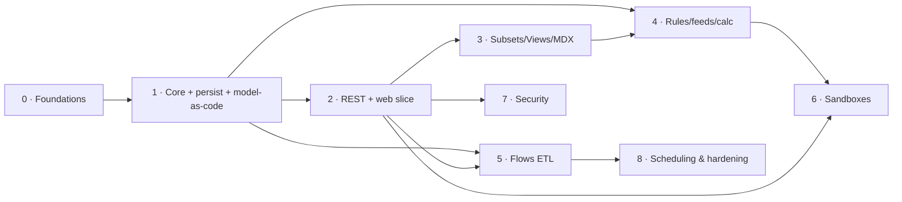

# Epiphany — Roadmap

**Codename:** Epiphany
**What it is:** A multidimensional, in-memory **OLAP server** with a **REST API** and a **web front end** — focused on cell-oriented modeling, a real calculation engine, and interactive write-back.
**Document version:** 2026-06-12
**Status:** Greenfield. Nothing built yet. This document is the plan of record.
**Scope:** Deliberately trimmed to a **core set** (2026-06-12). Everything outside the core is recorded in §13 (Deferred / out of scope) rather than dropped — to be revisited on demand.

---

## 1. Vision

Build a self-hostable, modern OLAP engine for multidimensional modeling and planning: cell-oriented cubes, weighted consolidations, a rules-and-feeds calculation engine, an MDX query layer, built-in ETL, what-if sandboxes, and a fast pivot grid with write-back — all driven by a clean JSON REST API.

The product is intentionally **deep, not wide**: nail the engine and the daily-use surface, and leave the long tail (dashboards, workflow, replication, exotic spreading, etc.) explicitly deferred.

### What sets Epiphany apart (committed differentiators)

These are deliberate improvements over the incumbent generation of multidimensional planning tools:

- **Model-as-code (Git-native).** Every object — dimensions, cubes, rules, flows, views — has a canonical, human-readable, diffable text form. The model lives in Git; the binary snapshot is just a runtime cache. (Incumbents store opaque blobs that don't review/diff/merge.)
- **TypeScript flows.** ETL/automation is authored in TypeScript with real types, tooling, and an editor with autocomplete — not a quirky proprietary DSL.
- **Automatic feeder inference.** The engine derives/validates the sparse-consolidation feeds and detects under/over-feeding — killing the incumbent's most bug-prone chore.
- **Calculation provenance ("explain").** Trace any cell to the rule, inputs, and feeder path that produced it.
- **Model testing framework.** First-class unit tests for rules and flows, runnable in CI.
- **Modern engineering defaults.** MVCC/snapshot isolation (reads never block writes), a single static cross-platform binary, UTF-8 everywhere, streaming for large cellsets, and built-in observability.

### Design north-star: dead-simple to use

**KISS for the end user overrides everything else in the UI** — whatever makes the product easiest to use wins.

- **Power underneath, simple on top.** The engine is deep (rules, feeds, code, Git); the surfaces stay shallow. Casual users never see the machinery.
- **Progressive disclosure.** Point-and-click for the common path; advanced controls (MDX, rules, flows, Git) are opt-in escape hatches, never required for everyday use.
- **Persona-appropriate surfaces.** *Business users* (the majority) just open a view, enter numbers, run what-if, and read results — effortlessly. *Modelers* get powerful editors with great defaults (auto-feeders, explain). *Admins* get a one-binary, zero-config start.
- **Zero-config onboarding.** One binary → open browser → a working demo model is already there. Fast time-to-first-value.
- **Sensible defaults + plain language.** Good defaults so settings are rarely touched; hide engine jargon in the UI; inline validation with helpful errors; undo everywhere.

### Performance & efficiency mandate

**Ultra performance and memory efficiency are hard requirements, not aspirations.** The engine must hold very large, sparse models in modest RAM and answer/calc them fast.

- **Memory: pay only for populated cells.** Sparse storage; packed integer coordinate keys (bit-packed element ordinals); interned strings; columnar attribute storage; a fast global allocator. Target a tight, measured per-cell footprint (budgets in §8).
- **Speed: least work, cache-friendly, parallel where it pays.** Sparse consolidation over only populated children; rules compiled (not re-parsed) and evaluated on-demand with memoization; auto-feeders to avoid wasted calc/memory; SIMD-friendly aggregation; streaming (never fully materialize huge cellsets).
- **Scripts orchestrate, native computes.** TypeScript flows call vectorized/batch host functions; the JS layer is never on the per-cell hot path.
- **Measure, don't guess.** Budgets (§8) are tracked by continuous benchmarks; regressions fail CI. Foundational layout (cell storage, coordinate encoding, rule eval) is decided up front via ADR because it's costly to retrofit; micro-optimization stays benchmark-driven.
- **Efficiency serves KISS.** Low footprint = runs on a laptop = the single-binary, zero-config deploy stays real.

### Testability & determinism mandate

**You must be able to directly and deterministically test every feature, and know for certain the app works at every milestone.** Determinism is a design constraint, not just a test-writing habit.

- **Directly testable at every layer.** The engine is a pure library with a deterministic API (testable with no server/UI); the REST API has in-process integration tests; the web UI has component + deterministically-seeded end-to-end tests. No behavior is reachable only by clicking around.
- **Deterministic by construction.** A server-wide *deterministic mode* used in tests: injected clock (no wall-clock in logic), seeded RNG/ID generation, fixed hash seed, ordered iteration, deterministic parallel reduction, and MVCC snapshots for consistent reads. Same inputs → identical outputs, every run.
- **Exact numbers.** Stored/monetary values use exact decimal or scaled-integer arithmetic (deterministic *and* correct for finance); floating point only where a documented tolerance is acceptable (ADR-0008).
- **Executable definitions of done.** Every phase/milestone ships a deterministic acceptance suite that proves its DoD; green in CI = done, flaky = bug. The shipped model testing framework gives users the same guarantee for their own models.

**One-line definition of done for the whole program:** a modeler can build cubes and dimensions, write calculation rules, load data through TypeScript flows, query and edit through a pivot grid with sandboxed what-if, secure it per-user, schedule refreshes, version the whole model in Git, and drive all of it through a documented REST API — correct and fast on large, sparse models.

---

## 2. Locked technology decisions

These were decided up front and constrain the rest of the plan. Changing them is an ADR-level decision.

| Area | Decision | Rationale |
|---|---|---|
| **Engine language** | **Rust** | Memory safety + C-level performance + fearless concurrency, no GC pauses on the hot calculation path. Right tool for an in-memory, write-heavy, highly concurrent multidimensional store. |
| **REST API** | **Clean modern JSON/HTTP REST** | A small, well-designed, versioned API surface. Compatibility with legacy OLAP wire protocols is **out of scope** (see §13). |
| **Front end** | **React + TypeScript** | Largest ecosystem for the defining UI element: a high-performance pivot/cube grid with write-back, plus the editors needed to operate the engine. |
| **Flow scripting** | **TypeScript on an embedded JS engine** | Real types, tooling, and ecosystem for ETL/automation. Engine (QuickJS / V8 / WASM) chosen by ADR-0004. Principle: *scripts orchestrate, native Rust does the bulk work.* |
| **Model format** | **Model-as-code (canonical text, Git-native)** | The model's source of truth is human-readable text; the runtime binary snapshot is a derived cache. Serialization format set by ADR-0003. |

Supporting choices (proposed, to be confirmed by ADR in Phase 0):

- **API framework:** Axum (Tokio) for the Rust HTTP layer.
- **Live updates:** WebSocket channel for cell/data change notifications.
- **Runtime persistence:** custom append-only transaction log + periodic binary snapshots (a cache over the text model, for fast restart).
- **Workspace layout:** a Cargo workspace of focused crates (see §5).
- **Front-end grid & editors:** evaluate AG Grid vs. TanStack Table vs. a custom canvas grid in Phase 2; Monaco for code editors (rules, flows).
- **Global allocator:** a fast allocator (mimalloc or jemalloc) for the write-heavy in-memory workload (ADR in Phase 1).
- **Cell storage:** packed integer coordinate keys + interned strings + fast hashing; hash index for point access, with a columnar option for bulk scans (ADR-0006).
- **Numeric model:** exact decimal / scaled-integer for stored & monetary values; float only with documented tolerance (ADR-0008).
- **Test infrastructure:** a server-wide deterministic mode (injected clock, seeded RNG/IDs, fixed hash seed); snapshot tests (insta), property tests (proptest), in-process REST integration tests, deterministically-seeded E2E (Playwright).

---

## 3. Guiding principles

This project follows [`agentic_ai_programming_best_practices.md`](agentic_ai_programming_best_practices.md). The rules that most shape this roadmap:

- **Dead-simple for the end user (overriding UX rule).** Whatever makes the product easiest to use wins; see the §1 design north-star. Power lives in the engine; surfaces stay shallow via progressive disclosure. The casual data-entry/analysis user must never be *required* to write MDX, rules, or flows, or to touch Git.
- **Deterministic & directly testable (binding).** Every feature is directly testable at its layer and produces identical results run-to-run; each phase/milestone is gated by an executable, deterministic acceptance suite. See the §1 testability mandate.
- **Small, focused changes (RG-01).** Each phase is sliced into independently shippable, reviewable units.
- **Simplicity over generality (RG-05 / UM-05/06).** Build the core the product actually needs. The deferred list (§13) exists precisely so we don't drift into the long tail.
- **Tests as behavior contracts (RG-04).** The calculation engine (rules + sparse feeds + consolidation) is correctness-critical and gets golden/property tests from day one — and the product itself ships a model testing framework so users get the same discipline.
- **Explicit contracts (RG-07).** The REST API is versioned and schema-first (OpenAPI). The engine's public crate APIs are documented and contract-tested.
- **Secure-by-design (RG-12).** AuthN, object/element security, flow sandboxing, and input validation are designed in, not bolted on.
- **Observability (RG-13).** Structured tracing, metrics, and calculation provenance are first-class, because OLAP performance/correctness problems are invisible without them.
- **Version-control hygiene (RG-09).** Model-as-code makes the whole model reviewable and diffable in Git — the discipline applies to the data model, not just the engine source.
- **ADRs (RG-16) + agent instructions (RG-17).** Significant decisions — including the scope cuts in §13 — get recorded. The repo gets an `AGENTS.md`/`CLAUDE.md` with build/test/run commands in Phase 0.

---

## 4. Core capability surface (in scope)

The committed feature set. Each item maps to a phase in §6 and is tracked in §7. Anything not listed here is in §13.

**A. Core multidimensional model**
- Cubes: cell-oriented, sparse storage, up to a high configurable maximum (design target: 256 dimensions).
- Dimensions: ordered element lists; **single hierarchy per dimension with multiple consolidation/rollup paths** (alternate rollups).
- Elements: leaf/simple (numeric **N**), consolidated (**C**), and string (**S**).
- Consolidations with **weight factors** (+1, −1, fractional).
- Element **attributes** (text/numeric) and **aliases**. *(Judgment-call inclusion — aliases are display names; MDX subsets filter/sort on attributes.)*

**B. Calculation engine**
- **Rules** language: a declarative, statically-analyzable expression language — area definitions, cross-cube cell references, arithmetic and conditional expressions, attribute/dimension lookup functions, consolidation overrides.
- **Sparse feeds + sparse-skip optimization** for correct, fast consolidation over rule-derived leaf cells.
- **Automatic feeder inference + validation** *(differentiator)*: derive feeds for analyzable rules, validate hand-written feeds, and detect under/over-feeding. (ADR-0005.)
- **Calculation provenance / "explain"** *(differentiator)*: trace any cell's value to the rule, inputs, and feeder path that produced it.
- Dependency tracking, on-demand calculation with in-query memoization, inter-cube rules.

**C. Query**
- **MDX** (commonly-used subset) for dynamic subsets and cellsets — membership, level/attribute filtering, sorting.
- Native **views**: rows/columns/titles/context, **zero suppression**, public/private.
- **Subsets**: static and dynamic (MDX-driven).

**D. Flows — ETL & automation**
- **Flows**: TypeScript scripts on an embedded JS engine, with **Init → Schema → Rows → Finalize** stages.
- Authoring DX: shipped host-API type definitions (`.d.ts`) + a Monaco editor with autocomplete and compile-time type-checking.
- Execution principle: *scripts orchestrate; native Rust host functions do bulk cell/metadata work.*
- Data sources: **flat/CSV**, **relational (SQL)**, cube **view** (plus source-less flows).
- Sandboxing: execution timeouts, memory caps, no ambient filesystem/network unless granted, determinism guards. (ADR-0004.)

**E. What-if & data entry**
- **Pivot grid with write-back** (nesting, zero suppression).
- **Sandboxes**: named, copy-on-write over base; commit/discard; per-user.

**F. Security**
- Users, **groups**, admin vs non-admin (admins bypass security).
- **Object security** (cube/dimension/rule/flow/job) and **element security**.
- Native authentication.

**G. Persistence & operation**
- In-memory store with durable runtime persistence: transaction log + snapshots; **crash recovery**; explicit full-persist command.
- **Scheduled jobs**: ordered sequences of flows run on a schedule.
- Baseline structured tracing/metrics (cross-cutting).

**H. Model-as-code & testing** *(differentiators)*
- **Canonical text serialization** of every object (dims/cubes/rules/flows/views), round-trippable and Git-friendly; the model is editable as files and as API objects. (ADR-0003.)
- **Model testing framework**: unit tests for rules and flows — fixtures + cell-value/outcome assertions — runnable locally, over the REST API, and in CI.

**I. Web front end (operate-the-engine surface)**
- Object browser; dimension/element editor; subset & view builders.
- The pivot grid (E).
- **Rules editor** and **flow editor** (Monaco: syntax highlighting, validation, type-check, error markers).

---

## 5. Target architecture

A Cargo workspace of focused crates behind a single server binary, plus a separate React app.

```
                          ┌─────────────────────────────┐
                          │   epiphany-web (React+TS)    │
                          │  pivot grid · editors        │
                          └───────────────┬─────────────┘
                                          │ HTTPS (JSON REST) + WebSocket
                          ┌───────────────▼─────────────┐
                          │      epiphany-api (Axum)     │  auth, routing, OpenAPI,
                          │  REST handlers · WS · authz  │  request validation
                          └───────────────┬─────────────┘
                                          │ in-process calls
   ┌──────────────┬─────────────┬─────────┴──────┬───────────────┬───────────────┐
   │ epiphany-    │ epiphany-   │  epiphany-mdx   │ epiphany-flow │ epiphany-     │
   │ core         │ calc        │  parse+eval     │ TS flows on   │ security      │
   │ dims, cubes, │ rules,feeds,│  subsets &      │ embedded JS + │ users/groups, │
   │ cells, attrs,│ inference,  │  cellsets       │ data sources  │ object/elem   │
   │ subsets,views│ provenance, │                 │ + scheduler   │ authz         │
   │ sandboxes,   │ dependency  │                 │ + flow tests  │               │
   │ text model   │ graph       │                 │               │               │
   └──────┬───────┴──────┬──────┴────────┬────────┴───────┬───────┴───────────────┘
          └──────────────┴───────────────┴────────────────┘
                                  │
                     ┌────────────▼─────────────┐
                     │     epiphany-persist      │  txn log + snapshots
                     │  runtime durability cache │  (derived from the text model)
                     └───────────────────────────┘

  epiphany-server: binary wiring all crates + config + scheduler + observability
```

**Model-as-code note:** every object's **canonical form is human-readable text** (the Git source of truth), defined alongside the core types in `epiphany-core`. `epiphany-persist` maintains the binary snapshot + transaction log purely as a **runtime cache** for fast restart — it is always reconstructible from the text model.

**Crate responsibilities (initial cut — boundaries are ADRs, not law):**

- **`epiphany-core`** — dimensions, hierarchy with alternate rollups, elements, attributes/aliases, a **memory-tight sparse cell store** (packed integer keys, interned strings), subsets, views, sandboxes, and the **canonical text (model-as-code) serialization** of all object types. The sparse consolidation algorithm lives here.
- **`epiphany-calc`** — rules parser/compiler, dependency graph, sparse feeds, **automatic feeder inference + validation**, **calculation provenance**, on-demand evaluation with in-query memoization.
- **`epiphany-mdx`** — MDX lexer/parser/evaluator for dynamic subsets and cellsets.
- **`epiphany-flow`** — **TypeScript flow** interpreter (embedded JS engine), host-function API, data-source connectors (CSV/SQL/view), the model testing runner, and the job scheduler.
- **`epiphany-security`** — native authn, users/groups, object & element authz.
- **`epiphany-persist`** — transaction log, snapshots, recovery, startup load (runtime cache over the text model).
- **`epiphany-api`** — Axum REST + WebSocket, OpenAPI schema, request validation, session/token handling.
- **`epiphany-server`** — the daemon: config, startup load, scheduler, tracing/metrics wiring.
- **`epiphany-web`** — React + TypeScript client.

**Key architectural questions to resolve via ADR:**

1. **ADR-0001 — Concurrency model.** Per-cube locks vs. sharded locks vs. **MVCC/copy-on-write snapshots** so reads never block writes. Sandboxes map naturally to COW overlays — this likely drives the whole design. *(Phase 0.)*
2. **ADR-0002 — Runtime persistence format.** Write-ahead-log fsync policy, snapshot cadence, recovery semantics. *(Phase 0.)*
3. **ADR-0003 — Model-as-code serialization format.** The canonical text representation (format, file layout, round-trip guarantees, merge-friendliness) for every object type. *(Phase 0, implemented Phase 1+.)*
4. **ADR-0004 — Embedded TypeScript engine.** QuickJS vs. V8 (`deno_core`) vs. WASM (`wasmtime`); transpile pipeline (swc); sandbox + resource-limit model. Decided with a perf spike. *(Phase 5.)*
5. **ADR-0005 — Automatic feeder inference strategy.** What is statically derivable, how manual feeds are validated, how under/over-feeding is detected. *(Phase 4.)*
6. **ADR-0006 — Cell storage & memory layout.** Packed element-ordinal coordinate keys (bit-packed to `u64`/`u128`, array fallback for extreme dimensionality), interned string pool, fast hashing + allocator, hash-index vs. columnar tradeoff, target bytes-per-cell. *(Phase 1.)*
7. **ADR-0007 — Rule evaluation strategy.** Compile rules to bytecode/closures (no per-cell re-parsing); evaluation plan, memoization, invalidation; optional JIT later. *(Phase 4.)*
8. **ADR-0008 — Numeric model & precision.** Exact decimal/scaled-integer vs. float for stored, consolidated, and rule-derived values; rounding rules; tolerance policy for analytics. Drives both finance correctness and determinism. *(Phase 1.)*
9. **ADR-0009 — Determinism strategy.** Clock/RNG/ID injection, fixed hash seed, deterministic aggregation/iteration order, deterministic parallel reduction, and the test-time deterministic mode. *(Phase 0.)*

---

## 6. Phased roadmap

Phases are ordered by dependency. Effort is sized **S / M / L / XL** (relative), not dated — calendar estimates would be invented without a team-size/velocity input (see §12). Each phase lists its goal, what it **proves**, key deliverables, and a definition of done.

> **Sequencing principle:** Phases 0→2 build a thin vertical slice through the whole stack as fast as possible, so we have a runnable, demoable product early. Depth (rules, flows, sandboxes, security) layers on after the skeleton works end to end.

> **Testability principle:** every phase **closes with a deterministic acceptance suite** that proves its DoD and runs in CI under deterministic mode. A phase isn't done until its suite is green and non-flaky.

### Phase 0 — Foundations & scaffolding · **S**
**Goal:** a healthy repo a new contributor/agent can build, test, and run on day one.
- Cargo workspace + crate skeletons; React app skeleton.
- CI: `cargo fmt`/`clippy`/`test`, web lint/typecheck/build, as a merge gate (RG-15).
- `AGENTS.md`/`CLAUDE.md` with build/test/run/validate commands (RG-17); `docs/adr/` with ADR template (RG-16).
- Baseline observability (`tracing`); error-handling conventions; config & secrets policy (`.env.example`, no secrets in source — RG-11); dependency/license policy (`cargo deny` — RG-10).
- **ADR-0001** (concurrency), **ADR-0002** (runtime persistence), **ADR-0003** (model-as-code format), **ADR-0008** (numeric model/precision), **ADR-0009** (determinism strategy) drafted.
- **Deterministic test harness:** server-wide deterministic mode (injected clock, seeded RNG/IDs, fixed hash seed, ordered iteration); golden/snapshot (insta) + property (proptest) scaffolding; the per-phase acceptance gate wired into CI.
- **DoD:** `cargo test` and the web build both pass in CI on an empty-but-wired skeleton.

### Phase 1 — Core model + persistence + model-as-code · **XL**
**Goal:** an in-memory engine that holds cubes and computes consolidations correctly, durably, and as Git-versionable text.
- Dimensions, elements (N/C/S), single hierarchy with alternate rollups, weighted consolidations.
- Cube definition, sparse cell store, leaf read/write.
- **Sparse consolidation algorithm** (aggregation without rules yet).
- Element attributes + aliases.
- **Canonical text serialization** for these object types: load-from-text / export-to-text, lossless round-trip (ADR-0003).
- Runtime persistence: snapshot save/load + transaction log + **crash recovery** + full-persist command (cache over the text model).
- **Memory layout (ADR-0006):** packed coordinate keys, interned strings, fast allocator; measure and track bytes-per-cell against the §8 budget from day one.
- Property/golden tests for consolidation correctness; criterion benchmarks for read/write/aggregate, wired into CI as regression gates.
- **Determinism:** deterministic aggregation order + exact numerics (ADR-0008) → results bit-reproducible run-to-run; **round-trip property test** (text → model → text is identity).
- **M1 acceptance suite** proves the milestone end to end under deterministic mode.
- **Proves:** the storage + aggregation core is correct and fast, and the model round-trips losslessly through text.
- **DoD:** load a multi-dim cube from text, write leaves, read consolidated values correctly, export to identical text, restart and recover identical state — and meet the initial per-cell memory and aggregation-latency budgets (§8) on a benchmark model.

### Phase 2 — REST API + minimal web UI (first end-to-end slice) · **L**
**Goal:** the whole stack runs; a user can browse and edit a cube in a browser.
- Axum REST: CRUD for dimensions/hierarchies/elements/cubes; cell read/write. OpenAPI published.
- Native auth (session/token) + users/groups; HTTPS; WebSocket change notifications.
- React app: login, object browser, dimension/element editor, **basic pivot grid** (read + write-back).
- **Dead-simple onboarding:** zero-config startup (single binary → open browser) with a bundled demo model; the pivot grid + data-entry flow is treated as the most-polished surface in the product.
- **Proves:** the architecture works front-to-back; first demoable milestone.
- **DoD:** from a clean start, a user logs in, opens a cube, edits a cell, sees consolidations update, and the change survives a server restart.

### Phase 3 — Subsets, views & MDX · **L**
**Goal:** real slicing/dicing and dynamic membership.
- Static subsets; **dynamic subsets via MDX**; MDX parser + evaluator (commonly-used subset).
- Native views (rows/cols/titles/context, **zero suppression**) and MDX cellsets; public/private; persistence.
- Web: point-and-click subset editor, view builder, nested rows/columns, zero-suppression toggle. **Point-and-click is the default path; MDX is an opt-in advanced escape hatch — never required for everyday use.**
- **DoD:** define an MDX subset, build a nested view on it, execute it to a cellset over REST and render it in the grid.

### Phase 4 — Rules, feeds & calculation engine · **XL**
**Goal:** the defining capability — rule-derived cells that consolidate correctly at scale, with the feeder pain solved.
- Rules language: lexer/parser, area definitions, cross-cube references, arithmetic/conditionals, attribute/dimension functions, consolidation overrides.
- Dependency graph + on-demand evaluation + in-query memoization with correct invalidation on write.
- **Rule compilation (ADR-0007):** compile rules to bytecode/closures and evaluate on-demand — no per-cell re-parsing. (Over-feed detection also serves memory: over-feeding wastes RAM.)
- **Sparse feeds + sparse-skip optimization** for rule-derived leaves; inter-cube rules.
- **Automatic feeder inference + validation + under/over-feeding detection** (ADR-0005). Honest scope: derive for the analyzable majority, validate manual feeds, diagnose the rest.
- **Calculation provenance / "explain"**: given a cell, return the rule, inputs, and feeder path.
- Rules serialize as model-as-code text; **rule unit tests** (model testing framework: fixtures + cell assertions).
- Heavy golden-file + property test suite; the highest-risk correctness area.
- **Invariant property tests:** children sum to parent under weights; every rule-derived cell that must be fed is fed (no under/over-feed); identical results run-to-run.
- Web: rules editor (Monaco: highlighting, validation, error markers); feed tracer / explain view.
- **DoD:** a model with cross-cube rules produces correct consolidated values matching golden results, with feeders auto-inferred/validated and no missing/over-fed cells; "explain" returns a correct provenance trace; rule unit tests run green in CI.

### Phase 5 — Flows (ETL & automation) · **L**
**Goal:** load data and build metadata programmatically, in TypeScript.
- **TypeScript flow** interpreter on an embedded JS engine (ADR-0004); transpile via swc; host-API with shipped `.d.ts`.
- Flow stages Init/Schema/Rows/Finalize; *scripts orchestrate, native bulk ops execute.*
- **Vectorized host functions** (batch row/cell operations) so the TypeScript layer is never on the per-cell hot path.
- Data sources: flat/CSV, cube **view**, relational (SQL); source-less flows.
- **Guided CSV import** (a simple wizard that generates a flow under the hood) for the common load case; full TypeScript flows for everything beyond it.
- Sandboxing & determinism: timeouts, memory caps, capability-gated FS/network; **virtual clock, seeded/forbidden RNG, stable iteration** so a flow re-run on the same inputs yields identical results.
- Flow persistence as model-as-code text; **flow unit tests** (extend the model testing framework).
- Web: Monaco flow editor with autocomplete/type-check and stage tabs.
- **DoD:** a TypeScript flow reads a CSV, builds dimension elements, loads cell values into a cube, reports row counts/errors, and has a passing unit test — runnable from the UI and the REST API.

### Phase 6 — Sandboxes (what-if) · **M**
**Goal:** interactive what-if without touching base data.
- **Sandboxes**: named, copy-on-write overlays over base; commit/discard; per-user. (Leans on the ADR-0001 concurrency model.)
- Calculation correctness over sandbox overlays (rules see overlaid values).
- Web: sandbox switcher; clear visual distinction of uncommitted values.
- **DoD:** a user enters what-if numbers in a sandbox, sees rules/consolidations recompute over them without affecting base data, then commits or discards.

### Phase 7 — Security: object & element · **M**
**Goal:** multi-user, least-privilege access over the core objects.
- **Object security** (cube/dimension/rule/flow/job) and **element security**; admin vs non-admin.
- Groups; security stored in internal control objects (and serialized as model-as-code).
- Web: security administration UI.
- **DoD:** a non-admin user sees and edits only permitted cubes/elements; an admin manages it from the UI.

### Phase 8 — Scheduling & hardening · **M**
**Goal:** production-usable operation.
- **Scheduled jobs** (ordered flow sequences) on the server scheduler.
- Persistence/ops hardening: recovery testing, graceful shutdown/restart, config surface.
- Performance/scale benchmarks vs. target model sizes and the §8 budgets; profiling; memory-footprint validation at scale.
- Promote parallel aggregation / persistent view cache *if and only if* benchmarks demand it (the architecture already allows them — §13).
- **DoD:** a job runs on schedule; a server recovers cleanly from a kill; benchmarks meet targets on representative models.

---

## 7. Coverage matrix (in scope)

Status legend: ☐ Planned · ◐ In progress · ☑ Done. All ☐ at kickoff. (Deferred items are in §13, not here.)

| Capability | Phase | Status |
|---|---|---|
| Cubes (high dim ceiling), sparse cell store | 1 | ☐ |
| Dimensions, elements (N/C/S) | 1 | ☐ |
| Single hierarchy + alternate rollups, weighted consolidations | 1 | ☐ |
| Element attributes & aliases | 1 | ☐ |
| Model-as-code (canonical text, Git round-trip) | 1+ | ☐ |
| Runtime persistence, crash recovery, full-persist | 1 / 8 | ☐ |
| REST API (CRUD, cells, OpenAPI) | 2 | ☐ |
| Native auth, users/groups | 2 / 7 | ☐ |
| Web pivot grid + write-back | 2 | ☐ |
| Subsets (static + dynamic/MDX) | 3 | ☐ |
| Views (native + MDX cellsets), zero suppression | 3 | ☐ |
| MDX engine (commonly-used subset) | 3 | ☐ |
| Rules language + cross-cube references | 4 | ☐ |
| Sparse feeds + sparse-skip optimization | 4 | ☐ |
| Automatic feeder inference + validation | 4 | ☐ |
| Calculation provenance / explain | 4 | ☐ |
| On-demand calc + in-query memoization | 4 | ☐ |
| TypeScript flows (Init/Schema/Rows/Finalize) | 5 | ☐ |
| Flow data sources (CSV/SQL/view) | 5 | ☐ |
| Model testing framework (rule + flow unit tests) | 4 / 5 | ☐ |
| Sandboxes (what-if) | 6 | ☐ |
| Object & element security | 7 | ☐ |
| Scheduled jobs | 8 | ☐ |
| Web editors (rules, flows, subsets, views) | 3–5 | ☐ |

---

## 8. Cross-cutting concerns (every phase)

- **UX / dead-simple (overriding — see §1 north-star):** progressive disclosure; sensible defaults; plain-language UI that hides engine jargon; inline validation with helpful errors; undo; zero-config startup with a bundled demo model. The business-user data-entry/analysis surface gets disproportionate polish — it's where most users live.
- **Testing & determinism (binding — see §1 mandate):** every feature directly testable at its layer (engine lib / in-process REST / seeded E2E); unit + **property** tests (proptest) per crate; **golden/snapshot** tests (insta) for calc/MDX/flows/API responses; all tests run in **deterministic mode** (injected clock, seeded RNG, fixed hash seed, ordered iteration) so results are identical run-to-run; **no flaky tests** (flaky = bug, fix or quarantine immediately). The calculation engine carries the strictest bar. The shipped **model testing framework** gives users the same guarantee for their models.
- **Model-as-code & VC hygiene (RG-09):** objects are text-first and Git-tracked; model changes are reviewable/diffable PRs; rule/flow unit tests run in CI alongside engine tests.
- **Performance & memory (binding NFR — see §1 mandate):** sparse storage with packed integer coordinate keys, interned strings, fast hashing + a fast global allocator; cache-/SIMD-friendly aggregation; compiled rules; streaming for large cellsets. Representative model fixtures (small/medium/large sparsity); continuous criterion benchmarks track query latency, write/bulk-load throughput, **bytes-per-cell**, and feed/consolidation cost. **Regressions fail CI.**
- **Security (RG-12):** validate all REST input at the boundary; least-privilege; flow sandboxing (resource limits + no ambient FS/network); no internal errors leaked to clients; secret scanning.
- **Observability (RG-13):** structured tracing with request IDs, metrics on query/calc/lock timings, calculation provenance, no secrets in logs.
- **Docs (RG-08):** API reference from OpenAPI; rules language reference; flow host-API reference (`.d.ts` + docs); architecture overview kept in sync.

**Performance & memory budgets (initial targets — to validate/tune in Phases 1 & 8 against real hardware/models; not promises):**

| Dimension | Initial target |
|---|---|
| Leaf-cell capacity | ~100M+ populated leaf cells on a commodity 64 GB host |
| Memory per numeric leaf cell | ≤ ~24 bytes incl. index overhead |
| Cold view query (typical) | p99 < ~1 s |
| Cached/repeat view query | p99 < ~100 ms |
| Bulk-load throughput | ≥ ~1M cells/sec/core |
| Startup (snapshot load, large model) | seconds, not minutes |

---

## 9. Phase dependency map



**Critical path:** 0 → 1 → 2 → 3 → 4 → 6. Phases 5, 7 can proceed in parallel once their prerequisites land; 8 closes out.

---

## 10. Suggested runnable milestones

1. **M1 — "It stores and aggregates"** (end of Phase 1): load a cube from text, write leaves, read correct consolidations, round-trip to text, recover after restart.
2. **M2 — "It's a product"** (end of Phase 2): browser login → open cube → edit cell → consolidations update → survives restart. *First demo.*
3. **M3 — "It slices"** (end of Phase 3): MDX subsets + nested views in the grid.
4. **M4 — "It calculates"** (end of Phase 4): rules + auto-inferred feeds produce correct results on a cross-cube model, with working "explain". *The defining milestone.*
5. **M5 — "It plans"** (end of Phase 6): sandboxed what-if recalculating over rules.

**Each milestone is gated by an automated, deterministic acceptance suite** — the DoD is executable, not a judgment call. Green suite in CI (deterministic mode) = milestone met; red or flaky = not done.

---

## 11. Risks & mitigations

| Risk | Impact | Mitigation |
|---|---|---|
| **Sparse feeds + consolidation correctness** is the hardest correctness problem in this class of engine. | High | Isolate in `epiphany-calc`; golden + property tests; auto-inference + diagnostics built alongside (Phase 4); study sparse-consolidation literature before designing. |
| **Automatic feeder inference is undecidable in general** (dynamically-addressed rules). | Medium | Don't overpromise: derive for the analyzable subset, validate manual feeds, and *detect* under/over-feeding everywhere. Inference is an aid, not a guarantee (ADR-0005). |
| **Concurrency model** wrong choice forces a rewrite. | High | Decide via ADR-0001 in Phase 0; prototype MVCC/COW early since sandboxes (Phase 6) depend on it. |
| **Embedded JS engine** perf/sandbox/footprint. | Medium | Principle: scripts orchestrate, native does bulk work. Enforce timeouts/memory/permission limits. Pick engine via ADR-0004 + a perf spike (QuickJS vs V8 vs WASM). |
| **MDX dialect** scope creep (MDX is huge). | Medium | Implement the commonly-used subset first; grow function coverage demand-driven (Phase 3). |
| **Performance/memory vs. mature in-memory C/C++ engines** (now a hard requirement). | High | Get foundational layout right up front (ADR-0006/0007: packed keys, interned strings, compiled rules, fast allocator); benchmark from Phase 1 against the §8 budgets with CI regression gates; promote parallel aggregation / view cache (§13) when benchmarks demand. |
| **Pivot-grid UX** for large, nested, write-back views is hard. | Medium | Evaluate grid libraries in Phase 2 before committing; virtualize aggressively. |
| **UX complexity creep** — a powerful engine tempts a complex UI. | High | The §1 north-star is binding: progressive disclosure, persona-appropriate surfaces, the casual user never sees code/MDX/Git. Usability-test the data-entry surface; treat its simplicity as non-negotiable. |
| **Nondeterminism** (FP summation order, hash iteration, concurrency, wall-clock, RNG) silently breaks reproducibility. | High | Server-wide deterministic mode (injected clock/RNG/seed, ordered aggregation, deterministic parallel reduction); exact decimal/scaled-int numerics for stored values (ADR-0008); golden/snapshot + property tests; flaky = bug. |
| **Scope creep back toward the deferred list.** | Medium | §13 is the contract; adding any deferred item requires an ADR and a phase plan, not a drive-by. |

---

## 12. Open questions

- **Team size / velocity** — needed to convert S/M/L/XL sizing into a calendar. Not assumed here on purpose.
- **Deployment target** — single-binary self-host? Docker/Kubernetes? Affects config and persistence (Phases 0, 8).
- **Multi-tenancy** — one model per server or multiple models/tenants per process? Affects core isolation design.
- **Licensing / open-source posture** — affects dependency policy and distribution.
- **Primary end-user persona to optimize hardest** — assumed: the non-technical business/data-entry user (largest, least-technical audience), without compromising modeler power. Confirm or adjust.
- **Project/product name** — "Epiphany" is the working codename from the directory; confirm or replace.

---

## 13. Deferred / out of scope (revisit on demand)

Consciously cut from the core to keep the program deep-not-wide. Recorded here (RG-16) so the decision is visible and reversible. Reintroducing any item requires an ADR + a phase plan.

**Model / calc**
- **Multiple named hierarchies per dimension** — alternate rollups within one hierarchy *are* in scope; separate named hierarchies are not. *Revisit if alternate rollups prove insufficient.*
- **Persistent cross-query view/calculation cache** — in-query memoization is in scope. *Likely promoted early given the performance mandate; architecture must not preclude it. Benchmark-gated.*
- **Multi-threaded / parallel query execution** — *Likely promoted early given the performance mandate; data structures (immutable snapshots, shardable index) chosen to allow it. Benchmark-gated.*

**Data entry**
- **Data spreading** (all methods: equal/proportional/repeat/% change/relational/holds/etc.).
- **Picklists** (static/subset/attribute-driven).
- *Revisit when interactive data-entry ergonomics become a priority; start with proportional/equal/repeat/clear.*

**Security**
- **Cell security** — *Revisit for regulated/complex models; it's performance-heavy and not universal.*
- **Fine-grained capabilities** and **LDAP/OIDC / directory integration** — native auth + admin/non-admin + object/element security ship first.

**Ops / scale**
- **Server-to-server replication/synchronization** — *likely a permanent cut; centralized/cloud deployments rarely use it.*
- **Audit/user-action logging** — the durability transaction log is in scope; compliance-grade audit is not.
- **Backup/restore tooling** — snapshot copy + the Git text model cover most of this; formal tooling deferred.
- **Operations console** — baseline metrics/tracing is cross-cutting and in scope; a full ops app is deferred.

**Front-end depth**
- **Boards/dashboards & visualizations** — *push reporting to a dedicated BI tool for now.*
- **Spreadsheet-style sheets ("websheets")** — *covered later by an Excel add-in if needed; biggest single build for overlapping value.*
- **Scorecards/KPIs** — *fold simple conditional formatting into the grid if needed.*
- **Plans + approval workflow** (assign/submit/approve).
- **Drill-through** to detail.

**Ecosystem**
- **Client SDKs** (Python/TS) and an **admin/automation CLI** — the REST API is the contract; SDKs are convenience.
- **Model import/migration** from external multidimensional systems.
- **Excel add-in.**
- **Legacy OLAP wire-protocol compatibility** — *likely a permanent cut absent a migration mandate.*

**Future "do-better" ideas (good someday, outside the core)**
- Native time-intelligence / calendar dimensions; rich cell types (dates/booleans/units); WASM user-defined functions; event streaming/webhooks; gRPC transport; git-like scenario branching beyond sandboxes.

---

## 14. Standards & technology references

- MDX language reference — https://learn.microsoft.com/en-us/analysis-services/multidimensional-models/mdx/multidimensional-expressions-mdx-reference
- The Rust Programming Language — https://doc.rust-lang.org/book/
- Tokio (async runtime) — https://tokio.rs/ · Axum (web framework) — https://docs.rs/axum/
- React — https://react.dev/ · TypeScript — https://www.typescriptlang.org/docs/
- Embedded scripting candidates — QuickJS/`rquickjs` (https://github.com/DelSkayn/rquickjs), `deno_core`/V8 (https://github.com/denoland/deno_core), `wasmtime` (https://wasmtime.dev/), swc (https://swc.rs/)
- AG Grid (data grid) — https://www.ag-grid.com/documentation/ · Monaco editor — https://microsoft.github.io/monaco-editor/
- Kimball & Ross, *The Data Warehouse Toolkit* — dimensional modeling reference.

---

## 15. How to use this roadmap

- This is a living document. Update the coverage matrix (§7) as work lands.
- Each phase should open with its own ADRs and close with a short retro note.
- §13 is the scope contract — treat additions to it as deliberate decisions, not drive-bys.
- When in doubt, follow [`agentic_ai_programming_best_practices.md`](agentic_ai_programming_best_practices.md): smallest coherent change, validate, document, keep the diff reviewable.
- Next concrete step is **Phase 0** scaffolding — say the word and that becomes the first set of focused PRs.
