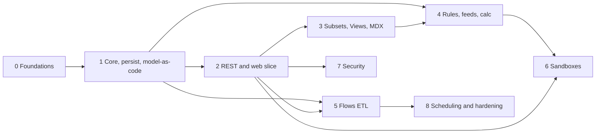

# Epiphany Roadmap

**Codename:** Epiphany
**What it is:** A multidimensional, in-memory **OLAP server** with a **REST API** and a **web front end**, focused on cell-oriented modeling, a real calculation engine, and interactive write-back.
**Document version:** 2026-06-12
**Status:** Greenfield. This document is the plan of record.
**Scope:** Deliberately trimmed to a **core set** (2026-06-12). Everything outside the core is recorded in section 13 (Deferred / out of scope) rather than dropped, to be revisited on demand.

---

## 1. Vision

Build a self-hostable, modern OLAP engine for multidimensional modeling and planning: cell-oriented cubes, weighted consolidations, a rules-and-feeds calculation engine, an MDX query layer, built-in ETL, what-if sandboxes, and a fast pivot grid with write-back, all driven by a clean JSON REST API.

The product is intentionally **deep, not wide**: nail the engine and the daily-use surface, and leave the long tail (dashboards, workflow, replication, exotic spreading, and so on) explicitly deferred.

### What sets Epiphany apart (committed differentiators)

These are deliberate improvements over the incumbent generation of multidimensional planning tools:

- **Model-as-code (Git-native).** Every object (dimensions, cubes, rules, flows, views) has a canonical, human-readable, diffable text form. The model lives in Git, and the binary snapshot is just a runtime cache. Incumbents store opaque blobs that do not review, diff, or merge.
- **TypeScript flows.** ETL and automation are authored in TypeScript with real types, tooling, and an editor with autocomplete, instead of a quirky proprietary DSL.
- **Automatic feeder inference.** The engine derives and validates the sparse-consolidation feeds and detects under-feeding and over-feeding, which kills the incumbent's most bug-prone chore.
- **Calculation provenance ("explain").** Trace any cell to the rule, inputs, and feeder path that produced it.
- **Model testing framework.** First-class unit tests for rules and flows, runnable in CI.
- **Modern engineering defaults.** MVCC and snapshot isolation (reads never block writes), a single static cross-platform binary, UTF-8 everywhere, streaming for large cellsets, and built-in observability.

### Design north-star: dead-simple to use

**KISS for the end user overrides everything else in the UI.** Whatever makes the product easiest to use wins.

- **Power underneath, simple on top.** The engine is deep (rules, feeds, code, Git); the surfaces stay shallow. Casual users never see the machinery.
- **Progressive disclosure.** Point-and-click for the common path. Advanced controls (MDX, rules, flows, Git) are opt-in escape hatches, never required for everyday use.
- **Persona-appropriate surfaces.** *Business users* (the majority) just open a view, enter numbers, run what-if, and read results, effortlessly. *Modelers* get powerful editors with great defaults (auto-feeders, explain). *Admins* get a one-binary, zero-config start.
- **Zero-config onboarding.** One binary, open the browser, and a working demo model is already there. Fast time-to-first-value.
- **Sensible defaults and plain language.** Good defaults so settings are rarely touched; hide engine jargon in the UI; inline validation with helpful errors; undo everywhere.

### Performance and efficiency mandate

**Ultra performance and memory efficiency are hard requirements, not aspirations.** The engine must hold very large, sparse models in modest RAM and answer and calculate them fast.

- **Memory: pay only for populated cells.** Sparse storage; packed integer coordinate keys (bit-packed element ordinals); interned strings; columnar attribute storage; a fast global allocator. Target a tight, measured per-cell footprint (budgets in section 8).
- **Speed: least work, cache-friendly, parallel where it pays.** Sparse consolidation over only populated children; rules compiled (not re-parsed) and evaluated on-demand with memoization; auto-feeders to avoid wasted calculation and memory; SIMD-friendly aggregation; streaming (never fully materialize huge cellsets).
- **Scripts orchestrate, native computes.** TypeScript flows call vectorized and batch host functions; the JS layer is never on the per-cell hot path.
- **Measure, do not guess.** Budgets (section 8) are tracked by continuous benchmarks; regressions fail CI. Foundational layout (cell storage, coordinate encoding, rule evaluation) is decided up front via ADR because it is costly to retrofit; micro-optimization stays benchmark-driven.
- **Efficiency serves KISS.** A low footprint means it runs on a laptop, which keeps the single-binary, zero-config deploy real.

### Testability and determinism mandate

**You must be able to directly and deterministically test every feature, and know for certain the app works at every milestone.** Determinism is a design constraint, not just a test-writing habit.

- **Directly testable at every layer.** The engine is a pure library with a deterministic API (testable with no server or UI); the REST API has in-process integration tests; the web UI has component tests and deterministically-seeded end-to-end tests. No behavior is reachable only by clicking around.
- **Deterministic by construction.** A server-wide *deterministic mode* used in tests: injected clock (no wall-clock in logic), seeded RNG and ID generation, fixed hash seed, ordered iteration, deterministic parallel reduction, and MVCC snapshots for consistent reads. The same inputs produce identical outputs, every run.
- **Exact numbers.** Stored and monetary values use exact decimal or scaled-integer arithmetic (deterministic *and* correct for finance); floating point only where a documented tolerance is acceptable (ADR-0008).
- **Executable definitions of done.** Every phase and milestone ships a deterministic acceptance suite that proves its DoD; green in CI means done, a flaky test means a bug. The shipped model testing framework gives users the same guarantee for their own models.

**One-line definition of done for the whole program:** a modeler can build cubes and dimensions, write calculation rules, load data through TypeScript flows, query and edit through a pivot grid with sandboxed what-if, secure it per-user, schedule refreshes, version the whole model in Git, and drive all of it through a documented REST API, correct and fast on large, sparse models.

---

## 2. Locked technology decisions

These were decided up front and constrain the rest of the plan. Changing them is an ADR-level decision.

| Area | Decision | Rationale |
|---|---|---|
| **Engine language** | **Rust** | Memory safety, C-level performance, and fearless concurrency, with no GC pauses on the hot calculation path. The right tool for an in-memory, write-heavy, highly concurrent multidimensional store. |
| **REST API** | **Clean modern JSON/HTTP REST** | A small, well-designed, versioned API surface. Compatibility with legacy OLAP wire protocols is **out of scope** (see section 13). |
| **Front end** | **React + TypeScript** | The largest ecosystem for the defining UI element: a high-performance pivot/cube grid with write-back, plus the editors needed to operate the engine. |
| **Flow scripting** | **TypeScript on an embedded JS engine** | Real types, tooling, and ecosystem for ETL and automation. The engine (QuickJS, V8, or WASM) is chosen by ADR-0004. Principle: *scripts orchestrate, native Rust does the bulk work.* |
| **Model format** | **Model-as-code (canonical text, Git-native)** | The model's source of truth is human-readable text; the runtime binary snapshot is a derived cache. Serialization format set by ADR-0003. |

Supporting choices (proposed, to be confirmed by ADR in Phase 0):

- **API framework:** Axum (Tokio) for the Rust HTTP layer.
- **Live updates:** a WebSocket channel for cell and data change notifications.
- **Runtime persistence:** a custom append-only transaction log plus periodic binary snapshots (a cache over the text model, for fast restart).
- **Workspace layout:** a Cargo workspace of focused crates (see section 5).
- **Front-end grid and editors:** evaluate AG Grid versus TanStack Table versus a custom canvas grid in Phase 2; Monaco for code editors (rules, flows).
- **Global allocator:** a fast allocator (mimalloc or jemalloc) for the write-heavy in-memory workload (ADR in Phase 1).
- **Cell storage:** packed integer coordinate keys, interned strings, and fast hashing; a hash index for point access, with a columnar option for bulk scans (ADR-0006).
- **Numeric model:** exact decimal or scaled-integer for stored and monetary values; float only with a documented tolerance (ADR-0008).
- **Test infrastructure:** a server-wide deterministic mode (injected clock, seeded RNG/IDs, fixed hash seed); snapshot tests (insta), property tests (proptest), in-process REST integration tests, and deterministically-seeded E2E (Playwright).

---

## 3. Guiding principles

This project follows [`agentic_ai_programming_best_practices.md`](agentic_ai_programming_best_practices.md). The rules that most shape this roadmap:

- **Dead-simple for the end user (overriding UX rule).** Whatever makes the product easiest to use wins; see the section 1 design north-star. Power lives in the engine; surfaces stay shallow via progressive disclosure. The casual data-entry and analysis user must never be *required* to write MDX, rules, or flows, or to touch Git.
- **Deterministic and directly testable (binding).** Every feature is directly testable at its layer and produces identical results run-to-run; each phase and milestone is gated by an executable, deterministic acceptance suite. See the section 1 testability mandate.
- **Small, focused changes (RG-01).** Each phase is sliced into independently shippable, reviewable units.
- **Simplicity over generality (RG-05, UM-05/06).** Build the core the product actually needs. The deferred list (section 13) exists precisely so we do not drift into the long tail.
- **Tests as behavior contracts (RG-04).** The calculation engine (rules, sparse feeds, consolidation) is correctness-critical and gets golden and property tests from day one. The product itself ships a model testing framework so users get the same discipline.
- **Explicit contracts (RG-07).** The REST API is versioned and schema-first (OpenAPI). The engine's public crate APIs are documented and contract-tested.
- **Secure-by-design (RG-12).** Authentication, object and element security, flow sandboxing, and input validation are designed in, not bolted on.
- **Observability (RG-13).** Structured tracing, metrics, and calculation provenance are first-class, because OLAP performance and correctness problems are invisible without them.
- **Version-control hygiene (RG-09).** Model-as-code makes the whole model reviewable and diffable in Git, so the discipline applies to the data model, not just the engine source.
- **ADRs (RG-16) and agent instructions (RG-17).** Significant decisions, including the scope cuts in section 13, get recorded. The repo gets an `AGENTS.md` with build, test, and run commands in Phase 0.

---

## 4. Core capability surface (in scope)

The committed feature set. Each item maps to a phase in section 6 and is tracked in section 7. Anything not listed here is in section 13.

**A. Core multidimensional model**
- Cubes: cell-oriented, sparse storage, up to a high configurable maximum (design target: 256 dimensions).
- Dimensions: ordered element lists; **a single hierarchy per dimension with multiple consolidation and rollup paths** (alternate rollups).
- Elements: leaf/simple (numeric **N**), consolidated (**C**), and string (**S**).
- Consolidations with **weight factors** (+1, -1, fractional).
- Element **attributes** (text and numeric) and **aliases**. (A judgment-call inclusion: aliases are display names, and MDX subsets filter and sort on attributes.)

**B. Calculation engine**
- A **rules** language: a declarative, statically-analyzable expression language with area definitions, cross-cube cell references, arithmetic and conditional expressions, attribute and dimension lookup functions, and consolidation overrides.
- **Sparse feeds and a sparse-skip optimization** for correct, fast consolidation over rule-derived leaf cells.
- **Automatic feeder inference and validation** *(differentiator)*: derive feeds for analyzable rules, validate hand-written feeds, and detect under-feeding and over-feeding (ADR-0005).
- **Calculation provenance, or "explain"** *(differentiator)*: trace any cell's value to the rule, inputs, and feeder path that produced it.
- Dependency tracking, on-demand calculation with in-query memoization, and inter-cube rules.

**C. Query**
- **MDX** (a commonly-used subset) for dynamic subsets and cellsets: membership, level and attribute filtering, and sorting.
- Native **views**: rows, columns, titles, context, **zero suppression**, public and private.
- **Subsets**: static and dynamic (MDX-driven).

**D. Flows (ETL and automation)**
- **Flows**: TypeScript scripts on an embedded JS engine, with **Init, Schema, Rows, and Finalize** stages.
- Authoring experience: shipped host-API type definitions (`.d.ts`) plus a Monaco editor with autocomplete and compile-time type-checking.
- Execution principle: *scripts orchestrate; native Rust host functions do the bulk cell and metadata work.*
- Data sources: **flat/CSV**, **relational (SQL)**, and cube **view** (plus source-less flows).
- Sandboxing: execution timeouts, memory caps, no ambient filesystem or network unless granted, and determinism guards (ADR-0004).

**E. What-if and data entry**
- A **pivot grid with write-back** (nesting, zero suppression).
- **Sandboxes**: named, copy-on-write over base; commit or discard; per-user.

**F. Security**
- Users, **groups**, and admin versus non-admin (admins bypass security).
- **Object security** (cube, dimension, rule, flow, job) and **element security**.
- Native authentication.

**G. Persistence and operation**
- An in-memory store with durable runtime persistence: transaction log plus snapshots, **crash recovery**, and an explicit full-persist command.
- **Scheduled jobs**: ordered sequences of flows run on a schedule.
- Baseline structured tracing and metrics (cross-cutting).

**H. Model-as-code and testing** *(differentiators)*
- **Canonical text serialization** of every object (dimensions, cubes, rules, flows, views), round-trippable and Git-friendly. The model is editable as files and as API objects (ADR-0003).
- A **model testing framework**: unit tests for rules and flows, with fixtures and cell-value or outcome assertions, runnable locally, over the REST API, and in CI.

**I. Web front end (operate-the-engine surface)**
- Object browser; dimension and element editor; subset and view builders.
- The pivot grid (E).
- A **rules editor** and a **flow editor** (Monaco: syntax highlighting, validation, type-check, error markers).

---

## 5. Target architecture

A Cargo workspace of focused crates behind a single server binary, plus a separate React app.

```
                          +-----------------------------+
                          |   epiphany-web (React+TS)    |
                          |  pivot grid , editors        |
                          +---------------+-------------+
                                          | HTTPS (JSON REST) + WebSocket
                          +---------------v-------------+
                          |      epiphany-api (Axum)     |  auth, routing, OpenAPI,
                          |  REST handlers , WS , authz  |  request validation
                          +---------------+-------------+
                                          | in-process calls
   +--------------+-------------+---------+------+---------------+---------------+
   | epiphany-    | epiphany-   |  epiphany-mdx   | epiphany-flow | epiphany-     |
   | core         | calc        |  parse+eval     | TS flows on   | security      |
   | dims, cubes, | rules,feeds,|  subsets &      | embedded JS + | users/groups, |
   | cells, attrs,| inference,  |  cellsets       | data sources  | object/elem   |
   | subsets,views| provenance, |                 | + scheduler   | authz         |
   | sandboxes,   | dependency  |                 | + flow tests  |               |
   | text model   | graph       |                 |               |               |
   +------+-------+------+------+--------+--------+-------+-------+---------------+
          +--------------+---------------+----------------+
                                  |
                     +------------v-------------+
                     |     epiphany-persist      |  txn log + snapshots
                     |  runtime durability cache |  (derived from the text model)
                     +---------------------------+

  epiphany-server: binary wiring all crates + config + scheduler + observability
```

**Model-as-code note:** every object's **canonical form is human-readable text** (the Git source of truth), defined alongside the core types in `epiphany-core`. `epiphany-persist` maintains the binary snapshot and transaction log purely as a **runtime cache** for fast restart. It is always reconstructible from the text model.

**Crate responsibilities (an initial cut; boundaries are ADRs, not law):**

- **`epiphany-core`:** dimensions, hierarchy with alternate rollups, elements, attributes and aliases, a **memory-tight sparse cell store** (packed integer keys, interned strings), subsets, views, sandboxes, and the **canonical text (model-as-code) serialization** of all object types. The sparse consolidation algorithm lives here.
- **`epiphany-calc`:** rules parser and compiler, dependency graph, sparse feeds, **automatic feeder inference and validation**, **calculation provenance**, and on-demand evaluation with in-query memoization.
- **`epiphany-mdx`:** MDX lexer, parser, and evaluator for dynamic subsets and cellsets.
- **`epiphany-flow`:** the **TypeScript flow** interpreter (embedded JS engine), host-function API, data-source connectors (CSV/SQL/view), the model testing runner, and the job scheduler.
- **`epiphany-security`:** native authentication, users and groups, and object and element authorization.
- **`epiphany-persist`:** transaction log, snapshots, recovery, and startup load (a runtime cache over the text model).
- **`epiphany-api`:** Axum REST and WebSocket, the OpenAPI schema, request validation, and session and token handling.
- **`epiphany-server`:** the daemon (config, startup load, scheduler, tracing and metrics wiring).
- **`epiphany-web`:** the React + TypeScript client.

**Key architectural questions to resolve via ADR:**

1. **ADR-0001, Concurrency model.** Per-cube locks versus sharded locks versus **MVCC and copy-on-write snapshots** so reads never block writes. Sandboxes map naturally to copy-on-write overlays, which likely drives the whole design. *(Phase 0.)*
2. **ADR-0002, Runtime persistence format.** Write-ahead-log fsync policy, snapshot cadence, and recovery semantics. *(Phase 0.)*
3. **ADR-0003, Model-as-code serialization format.** The canonical text representation (format, file layout, round-trip guarantees, merge-friendliness) for every object type. *(Phase 0, implemented Phase 1 onward.)*
4. **ADR-0004, Embedded TypeScript engine.** QuickJS versus V8 (`deno_core`) versus WASM (`wasmtime`); the transpile pipeline (swc); the sandbox and resource-limit model. Decided with a performance spike. *(Phase 5.)*
5. **ADR-0005, Automatic feeder inference strategy.** What is statically derivable, how manual feeds are validated, and how under-feeding and over-feeding are detected. *(Phase 4.)*
6. **ADR-0006, Cell storage and memory layout.** Packed element-ordinal coordinate keys (bit-packed to `u64`/`u128`, with an array fallback for extreme dimensionality), an interned string pool, fast hashing and allocator, the hash-index versus columnar tradeoff, and a target bytes-per-cell. *(Phase 1.)*
7. **ADR-0007, Rule evaluation strategy.** Compile rules to bytecode or closures (no per-cell re-parsing); the evaluation plan, memoization, and invalidation; an optional JIT later. *(Phase 4.)*
8. **ADR-0008, Numeric model and precision.** Exact decimal or scaled-integer versus float for stored, consolidated, and rule-derived values; rounding rules; a tolerance policy for analytics. Drives both finance correctness and determinism. *(Phase 1.)*
9. **ADR-0009, Determinism strategy.** Clock, RNG, and ID injection; a fixed hash seed; deterministic aggregation and iteration order; deterministic parallel reduction; and the test-time deterministic mode. *(Phase 0.)*

---

## 6. Phased roadmap

Phases are ordered by dependency. Effort is sized **S / M / L / XL** (relative), not dated, because calendar estimates would be invented without a team-size or velocity input (see section 12). Each phase lists its goal, what it **proves**, key deliverables, and a definition of done.

> **Sequencing principle:** Phases 0 through 2 build a thin vertical slice through the whole stack as fast as possible, so we have a runnable, demoable product early. Depth (rules, flows, sandboxes, security) layers on after the skeleton works end to end.

> **Testability principle:** every phase **closes with a deterministic acceptance suite** that proves its DoD and runs in CI under deterministic mode. A phase is not done until its suite is green and non-flaky.

### Phase 0: Foundations and scaffolding (size S)
**Goal:** a healthy repo a new contributor or agent can build, test, and run on day one.
- A Cargo workspace plus crate skeletons; a React app skeleton.
- CI: `cargo fmt`, `clippy`, `test`, and web lint/typecheck/build, as a merge gate (RG-15).
- `AGENTS.md` with build, test, run, and validate commands (RG-17); `docs/adr/` with an ADR template (RG-16).
- Baseline observability (`tracing`); error-handling conventions; a config and secrets policy (`.env.example`, no secrets in source, RG-11); a dependency and license policy (`cargo deny`, RG-10).
- **ADR-0001** (concurrency), **ADR-0002** (runtime persistence), **ADR-0003** (model-as-code format), **ADR-0008** (numeric model and precision), and **ADR-0009** (determinism strategy) drafted.
- A **deterministic test harness:** server-wide deterministic mode (injected clock, seeded RNG/IDs, fixed hash seed, ordered iteration); golden and snapshot (insta) plus property (proptest) scaffolding; the per-phase acceptance gate wired into CI.
- **DoD:** `cargo test` and the web build both pass in CI on an empty-but-wired skeleton.

### Phase 1: Core model, persistence, and model-as-code (size XL)
**Goal:** an in-memory engine that holds cubes and computes consolidations correctly, durably, and as Git-versionable text.
- Dimensions, elements (N/C/S), a single hierarchy with alternate rollups, and weighted consolidations.
- Cube definition, a sparse cell store, and leaf read and write.
- The **sparse consolidation algorithm** (aggregation without rules yet).
- Element attributes and aliases.
- **Canonical text serialization** for these object types: load-from-text and export-to-text, with a lossless round-trip (ADR-0003).
- Runtime persistence: snapshot save and load, a transaction log, **crash recovery**, and a full-persist command (a cache over the text model).
- **Memory layout (ADR-0006):** packed coordinate keys, interned strings, a fast allocator; measure and track bytes-per-cell against the section 8 budget from day one.
- Property and golden tests for consolidation correctness; criterion benchmarks for read, write, and aggregate, wired into CI as regression gates.
- **Determinism:** a deterministic aggregation order plus exact numerics (ADR-0008) make results bit-reproducible run-to-run; a **round-trip property test** (text to model to text is identity).
- An **M1 acceptance suite** proves the milestone end to end under deterministic mode.
- **Proves:** the storage and aggregation core is correct and fast, and the model round-trips losslessly through text.
- **DoD:** load a multi-dim cube from text, write leaves, read consolidated values correctly, export to identical text, restart and recover identical state, and meet the initial per-cell memory and aggregation-latency budgets (section 8) on a benchmark model.

### Phase 2: REST API and minimal web UI (first end-to-end slice) (size L)
**Goal:** the whole stack runs; a user can browse and edit a cube in a browser.
- Axum REST: CRUD for dimensions, hierarchies, elements, and cubes; cell read and write. OpenAPI published.
- Native auth (session or token) plus users and groups; HTTPS; WebSocket change notifications.
- A React app: login, object browser, dimension and element editor, and a **basic pivot grid** (read and write-back).
- **Dead-simple onboarding:** zero-config startup (single binary, open the browser) with a bundled demo model; the pivot grid and data-entry flow is treated as the most-polished surface in the product.
- **Proves:** the architecture works front-to-back; the first demoable milestone.
- **DoD:** from a clean start, a user logs in, opens a cube, edits a cell, sees consolidations update, and the change survives a server restart.

### Phase 3: Subsets, views, and MDX (size L)
**Goal:** real slicing and dicing, and dynamic membership.
- Static subsets; **dynamic subsets via MDX**; an MDX parser and evaluator (a commonly-used subset).
- Native views (rows, columns, titles, context, **zero suppression**) and MDX cellsets; public and private; persistence.
- Web: a point-and-click subset editor, view builder, nested rows and columns, and a zero-suppression toggle. **Point-and-click is the default path; MDX is an opt-in advanced escape hatch, never required for everyday use.**
- **DoD:** define an MDX subset, build a nested view on it, execute it to a cellset over REST, and render it in the grid.

### Phase 4: Rules, feeds, and calculation engine (size XL)
**Goal:** the defining capability, rule-derived cells that consolidate correctly at scale, with the feeder pain solved.
- A rules language: lexer and parser, area definitions, cross-cube references, arithmetic and conditionals, attribute and dimension functions, and consolidation overrides.
- A dependency graph plus on-demand evaluation plus in-query memoization with correct invalidation on write.
- **Rule compilation (ADR-0007):** compile rules to bytecode or closures and evaluate on-demand, with no per-cell re-parsing. (Over-feed detection also serves memory: over-feeding wastes RAM.)
- **Sparse feeds and a sparse-skip optimization** for rule-derived leaves; inter-cube rules.
- **Automatic feeder inference, validation, and under/over-feeding detection** (ADR-0005). Honest scope: derive for the analyzable majority, validate manual feeds, and diagnose the rest.
- **Calculation provenance, or "explain":** given a cell, return the rule, inputs, and feeder path.
- Rules serialize as model-as-code text; **rule unit tests** (the model testing framework: fixtures plus cell assertions).
- A heavy golden-file plus property test suite; the highest-risk correctness area.
- **Invariant property tests:** children sum to parent under weights; every rule-derived cell that must be fed is fed (no under-feed or over-feed); identical results run-to-run.
- Web: a rules editor (Monaco: highlighting, validation, error markers) and a feed tracer or explain view.
- **DoD:** a model with cross-cube rules produces correct consolidated values matching golden results, with feeders auto-inferred and validated and no missing or over-fed cells; "explain" returns a correct provenance trace; rule unit tests run green in CI.

### Phase 5: Flows (ETL and automation) (size L)
**Goal:** load data and build metadata programmatically, in TypeScript.
- A **TypeScript flow** interpreter on an embedded JS engine (ADR-0004); transpile via swc; a host API with shipped `.d.ts`.
- Flow stages Init, Schema, Rows, and Finalize; *scripts orchestrate, native bulk ops execute.*
- **Vectorized host functions** (batch row and cell operations) so the TypeScript layer is never on the per-cell hot path.
- Data sources: flat/CSV, cube **view**, and relational (SQL); plus source-less flows.
- A **guided CSV import** (a simple wizard that generates a flow under the hood) for the common load case; full TypeScript flows for everything beyond it.
- Sandboxing and determinism: timeouts, memory caps, capability-gated filesystem and network; a **virtual clock, seeded or forbidden RNG, and stable iteration** so a flow re-run on the same inputs yields identical results.
- Flow persistence as model-as-code text; **flow unit tests** (extending the model testing framework).
- Web: a Monaco flow editor with autocomplete, type-check, and stage tabs.
- **DoD:** a TypeScript flow reads a CSV, builds dimension elements, loads cell values into a cube, reports row counts and errors, and has a passing unit test, runnable from the UI and the REST API.

### Phase 6: Sandboxes (what-if) (size M)
**Goal:** interactive what-if without touching base data.
- **Sandboxes**: named, copy-on-write overlays over base; commit or discard; per-user. (Leans on the ADR-0001 concurrency model.)
- Calculation correctness over sandbox overlays (rules see overlaid values).
- Web: a sandbox switcher and a clear visual distinction of uncommitted values.
- **DoD:** a user enters what-if numbers in a sandbox, sees rules and consolidations recompute over them without affecting base data, then commits or discards.

### Phase 7: Security, object and element (size M)
**Goal:** multi-user, least-privilege access over the core objects.
- **Object security** (cube, dimension, rule, flow, job) and **element security**; admin versus non-admin.
- Groups; security stored in internal control objects (and serialized as model-as-code).
- Web: a security administration UI.
- **DoD:** a non-admin user sees and edits only permitted cubes and elements; an admin manages it from the UI.

### Phase 8: Scheduling and hardening (size M)
**Goal:** production-usable operation.
- **Scheduled jobs** (ordered flow sequences) on the server scheduler.
- Persistence and ops hardening: recovery testing, graceful shutdown and restart, and a config surface.
- Performance and scale benchmarks versus target model sizes and the section 8 budgets; profiling; memory-footprint validation at scale.
- Promote parallel aggregation or a persistent view cache *if and only if* benchmarks demand it (the architecture already allows them, see section 13).
- **DoD:** a job runs on schedule; a server recovers cleanly from a kill; benchmarks meet targets on representative models.

---

## 7. Coverage matrix (in scope)

Status legend: [ ] Planned, [~] In progress, [x] Done. All [ ] at kickoff. (Deferred items are in section 13, not here.)

| Capability | Phase | Status |
|---|---|---|
| Cubes (high dim ceiling), sparse cell store | 1 | [ ] |
| Dimensions, elements (N/C/S) | 1 | [ ] |
| Single hierarchy with alternate rollups, weighted consolidations | 1 | [ ] |
| Element attributes and aliases | 1 | [ ] |
| Model-as-code (canonical text, Git round-trip) | 1+ | [ ] |
| Runtime persistence, crash recovery, full-persist | 1, 8 | [ ] |
| REST API (CRUD, cells, OpenAPI) | 2 | [ ] |
| Native auth, users and groups | 2, 7 | [ ] |
| Web pivot grid with write-back | 2 | [ ] |
| Subsets (static and dynamic/MDX) | 3 | [ ] |
| Views (native and MDX cellsets), zero suppression | 3 | [ ] |
| MDX engine (commonly-used subset) | 3 | [ ] |
| Rules language with cross-cube references | 4 | [ ] |
| Sparse feeds and sparse-skip optimization | 4 | [ ] |
| Automatic feeder inference and validation | 4 | [ ] |
| Calculation provenance / explain | 4 | [ ] |
| On-demand calc with in-query memoization | 4 | [ ] |
| TypeScript flows (Init/Schema/Rows/Finalize) | 5 | [ ] |
| Flow data sources (CSV/SQL/view) | 5 | [ ] |
| Model testing framework (rule and flow unit tests) | 4, 5 | [ ] |
| Sandboxes (what-if) | 6 | [ ] |
| Object and element security | 7 | [ ] |
| Scheduled jobs | 8 | [ ] |
| Web editors (rules, flows, subsets, views) | 3 to 5 | [ ] |

---

## 8. Cross-cutting concerns (every phase)

- **UX, dead-simple (overriding, see the section 1 north-star):** progressive disclosure; sensible defaults; a plain-language UI that hides engine jargon; inline validation with helpful errors; undo; zero-config startup with a bundled demo model. The business-user data-entry and analysis surface gets disproportionate polish, because it is where most users live.
- **Testing and determinism (binding, see the section 1 mandate):** every feature directly testable at its layer (engine library, in-process REST, seeded E2E); unit plus **property** tests (proptest) per crate; **golden and snapshot** tests (insta) for calc, MDX, flows, and API responses; all tests run in **deterministic mode** (injected clock, seeded RNG, fixed hash seed, ordered iteration) so results are identical run-to-run; **no flaky tests** (a flaky test is a bug, fixed or quarantined immediately). The calculation engine carries the strictest bar. The shipped **model testing framework** gives users the same guarantee for their models.
- **Model-as-code and VC hygiene (RG-09):** objects are text-first and Git-tracked; model changes are reviewable, diffable pull requests; rule and flow unit tests run in CI alongside engine tests.
- **Performance and memory (binding NFR, see the section 1 mandate):** sparse storage with packed integer coordinate keys, interned strings, and fast hashing plus a fast global allocator; cache-friendly and SIMD-friendly aggregation; compiled rules; streaming for large cellsets. Representative model fixtures (small, medium, large sparsity); continuous criterion benchmarks track query latency, write and bulk-load throughput, **bytes-per-cell**, and feed and consolidation cost. **Regressions fail CI.**
- **Security (RG-12):** validate all REST input at the boundary; least-privilege; flow sandboxing (resource limits, no ambient filesystem or network); no internal errors leaked to clients; secret scanning.
- **Observability (RG-13):** structured tracing with request IDs, metrics on query, calc, and lock timings, calculation provenance, and no secrets in logs.
- **Docs (RG-08):** an API reference from OpenAPI; a rules language reference; a flow host-API reference (`.d.ts` plus docs); an architecture overview kept in sync.

**Performance and memory budgets (initial targets, to validate and tune in Phases 1 and 8 against real hardware and models; these are not promises):**

| Dimension | Initial target |
|---|---|
| Leaf-cell capacity | roughly 100M or more populated leaf cells on a commodity 64 GB host |
| Memory per numeric leaf cell | about 24 bytes or less, including index overhead |
| Cold view query (typical) | p99 under about 1 s |
| Cached or repeat view query | p99 under about 100 ms |
| Bulk-load throughput | about 1M cells per second per core or more |
| Startup (snapshot load, large model) | seconds, not minutes |

---

## 9. Phase dependency map



**Critical path:** 0, then 1, 2, 3, 4, and 6. Phases 5 and 7 can proceed in parallel once their prerequisites land; 8 closes out.

---

## 10. Suggested runnable milestones

1. **M1, "It stores and aggregates"** (end of Phase 1): load a cube from text, write leaves, read correct consolidations, round-trip to text, recover after restart.
2. **M2, "It's a product"** (end of Phase 2): browser login, open a cube, edit a cell, see consolidations update, and survive a restart. The first demo.
3. **M3, "It slices"** (end of Phase 3): MDX subsets plus nested views in the grid.
4. **M4, "It calculates"** (end of Phase 4): rules plus auto-inferred feeds produce correct results on a cross-cube model, with working "explain". The defining milestone.
5. **M5, "It plans"** (end of Phase 6): sandboxed what-if recalculating over rules.

**Each milestone is gated by an automated, deterministic acceptance suite.** The DoD is executable, not a judgment call. A green suite in CI (deterministic mode) means the milestone is met; red or flaky means it is not done.

---

## 11. Risks and mitigations

| Risk | Impact | Mitigation |
|---|---|---|
| **Sparse feeds plus consolidation correctness** is the hardest correctness problem in this class of engine. | High | Isolate in `epiphany-calc`; golden and property tests; auto-inference and diagnostics built alongside (Phase 4); study sparse-consolidation literature before designing. |
| **Automatic feeder inference is undecidable in general** (dynamically-addressed rules). | Medium | Do not overpromise: derive for the analyzable subset, validate manual feeds, and *detect* under-feeding and over-feeding everywhere. Inference is an aid, not a guarantee (ADR-0005). |
| **A wrong concurrency model** forces a rewrite. | High | Decide via ADR-0001 in Phase 0; prototype MVCC/COW early, since sandboxes (Phase 6) depend on it. |
| **The embedded JS engine** has performance, sandbox, or footprint problems. | Medium | Principle: scripts orchestrate, native does the bulk work. Enforce timeouts, memory, and permission limits. Pick the engine via ADR-0004 plus a performance spike (QuickJS, V8, or WASM). |
| **MDX dialect** scope creep (MDX is huge). | Medium | Implement the commonly-used subset first; grow function coverage demand-driven (Phase 3). |
| **Performance and memory versus mature in-memory C/C++ engines** (now a hard requirement). | High | Get the foundational layout right up front (ADR-0006/0007: packed keys, interned strings, compiled rules, fast allocator); benchmark from Phase 1 against the section 8 budgets with CI regression gates; promote parallel aggregation or a view cache (section 13) when benchmarks demand. |
| **Pivot-grid UX** for large, nested, write-back views is hard. | Medium | Evaluate grid libraries in Phase 2 before committing; virtualize aggressively. |
| **UX complexity creep**: a powerful engine tempts a complex UI. | High | The section 1 north-star is binding: progressive disclosure, persona-appropriate surfaces, and the casual user never sees code, MDX, or Git. Usability-test the data-entry surface and treat its simplicity as non-negotiable. |
| **Nondeterminism** (float summation order, hash iteration, concurrency, wall-clock, RNG) silently breaks reproducibility. | High | A server-wide deterministic mode (injected clock, RNG, and seed, ordered aggregation, deterministic parallel reduction); exact decimal or scaled-int numerics for stored values (ADR-0008); golden, snapshot, and property tests; a flaky test is a bug. |
| **Scope creep back toward the deferred list.** | Medium | Section 13 is the contract; adding any deferred item requires an ADR and a phase plan, not a drive-by. |

---

## 12. Open questions

- **Team size and velocity:** needed to convert S/M/L/XL sizing into a calendar. Not assumed here on purpose.
- **Deployment target:** single-binary self-host? Docker or Kubernetes? Affects config and persistence (Phases 0 and 8).
- **Multi-tenancy:** one model per server, or multiple models and tenants per process? Affects core isolation design.
- **Licensing and open-source posture:** affects dependency policy and distribution.
- **Primary end-user persona to optimize hardest:** assumed to be the non-technical business and data-entry user (the largest, least-technical audience), without compromising modeler power. Confirm or adjust.
- **Project and product name:** "Epiphany" is the working codename from the directory; confirm or replace.

---

## 13. Deferred / out of scope (revisit on demand)

Consciously cut from the core to keep the program deep, not wide. Recorded here (RG-16) so the decision is visible and reversible. Reintroducing any item requires an ADR and a phase plan.

**Model and calc**
- **Multiple named hierarchies per dimension.** Alternate rollups within one hierarchy *are* in scope; separate named hierarchies are not. *Revisit if alternate rollups prove insufficient.*
- **A persistent cross-query view or calculation cache.** In-query memoization is in scope. *Likely promoted early given the performance mandate; the architecture must not preclude it. Benchmark-gated.*
- **Multi-threaded or parallel query execution.** *Likely promoted early given the performance mandate; data structures (immutable snapshots, a shardable index) are chosen to allow it. Benchmark-gated.*

**Data entry**
- **Data spreading** (all methods: equal, proportional, repeat, percent change, relational, holds, and so on).
- **Picklists** (static, subset-driven, attribute-driven).
- *Revisit when interactive data-entry ergonomics become a priority; start with proportional, equal, repeat, and clear.*

**Security**
- **Cell security.** *Revisit for regulated or complex models; it is performance-heavy and not universal.*
- **Fine-grained capabilities** and **LDAP/OIDC or directory integration.** Native auth, admin versus non-admin, and object and element security ship first.

**Ops and scale**
- **Server-to-server replication or synchronization.** *Likely a permanent cut; centralized and cloud deployments rarely use it.*
- **Audit or user-action logging.** The durability transaction log is in scope; compliance-grade audit is not.
- **Backup and restore tooling.** A snapshot copy plus the Git text model cover most of this; formal tooling is deferred.
- **An operations console.** Baseline metrics and tracing is cross-cutting and in scope; a full ops app is deferred.

**Front-end depth**
- **Boards, dashboards, and visualizations.** *Push reporting to a dedicated BI tool for now.*
- **Spreadsheet-style sheets ("websheets").** *Covered later by an Excel add-in if needed; the biggest single build for overlapping value.*
- **Scorecards and KPIs.** *Fold simple conditional formatting into the grid if needed.*
- **Plans plus an approval workflow** (assign, submit, approve).
- **Drill-through** to detail.

**Ecosystem**
- **Client SDKs** (Python, TS) and an **admin or automation CLI.** The REST API is the contract; SDKs are convenience.
- **Model import or migration** from external multidimensional systems.
- **An Excel add-in.**
- **Legacy OLAP wire-protocol compatibility.** *Likely a permanent cut absent a migration mandate.*

**Future "do-better" ideas (good someday, outside the core)**
- Native time-intelligence and calendar dimensions; rich cell types (dates, booleans, units); WASM user-defined functions; event streaming and webhooks; gRPC transport; git-like scenario branching beyond sandboxes.

---

## 14. Standards and technology references

- MDX language reference: https://learn.microsoft.com/en-us/analysis-services/multidimensional-models/mdx/multidimensional-expressions-mdx-reference
- The Rust Programming Language: https://doc.rust-lang.org/book/
- Tokio (async runtime): https://tokio.rs/ and Axum (web framework): https://docs.rs/axum/
- React: https://react.dev/ and TypeScript: https://www.typescriptlang.org/docs/
- Embedded scripting candidates: QuickJS via `rquickjs` (https://github.com/DelSkayn/rquickjs), `deno_core` and V8 (https://github.com/denoland/deno_core), `wasmtime` (https://wasmtime.dev/), and swc (https://swc.rs/)
- AG Grid (data grid): https://www.ag-grid.com/documentation/ and the Monaco editor: https://microsoft.github.io/monaco-editor/
- Kimball and Ross, *The Data Warehouse Toolkit*, a dimensional modeling reference.

---

## 15. How to use this roadmap

- This is a living document. Update the coverage matrix (section 7) as work lands.
- Each phase should open with its own ADRs and close with a short retro note.
- Section 13 is the scope contract; treat additions to it as deliberate decisions, not drive-bys.
- When in doubt, follow [`agentic_ai_programming_best_practices.md`](agentic_ai_programming_best_practices.md): the smallest coherent change, validate, document, and keep the diff reviewable.
- The next concrete step is **Phase 0** scaffolding; say the word and that becomes the first set of focused PRs.
